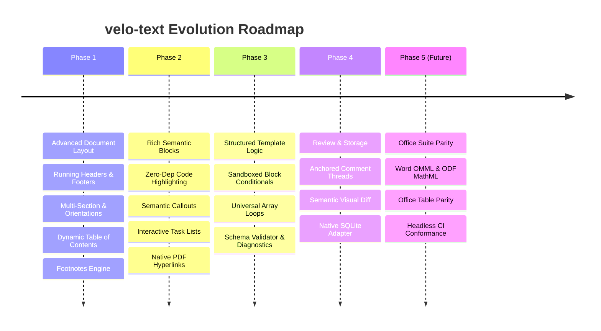

# Technical Feature Specifications & Implementation Roadmap

> **Standard:** Strict zero external runtime dependencies (`dependencies: {}`). All features are built purely on modern ECMAScript, Web APIs, and Node.js built-in modules (`node:crypto`, `node:zlib`, `node:buffer`, `node:sqlite`).

This document defines the technical architecture, data model modifications, algorithms, and detailed implementation tasks for the upcoming features in **velo-text**.

---

## 1. Architectural Guardrails & Philosophy

1. **Single Source of Truth:** The canonical JSON AST is the sole authoritative document state. HTML, DOM, and PDF are derived representations.
2. **Deterministic Outputs:** Given identical inputs, timestamps, and seeds, all operations and exporters produce bit-for-bit identical outputs.
3. **Pure Core with Platform Ports:** The core model and export layers never access globals like `window`, `document`, or filesystem APIs directly. All platform interactions flow through typed interfaces: `BinarySink`, `Clock`, `IdGenerator`, and `AssetResolver`.
4. **Strict Isolation & Zero Runtime Dependencies:** No external npm dependencies are permitted in production builds. Development dependencies are strictly limited to testing runners, TypeScript, and documentation generators.
5. **Quality & Coverage Gates:** Every new feature must include unit tests running on the internal TAP runner (`scripts/runner.js`), maintain module coverage above 90% statements and 70% branches, and pass `check:zero-deps`, `check:circular`, and `lint`.

---

## 2. Roadmap Overview



---

## Phase 1: Advanced Document Layout & Editorial Pagination

### Task 1.1: Running Headers & Footers with Dynamic Pagination Variables

#### Context & Problem
Professional reports, agreements, and whitepapers require headers and footers that repeat across pages, support different first-page layouts, alternate between odd/even pages, and compute dynamic page variables like current page and total pages.

#### Data Model Specification
Extend `DocumentPageSettings` in `src/core/model/types.ts`:

```ts
export interface HeaderFooterZone {
  left?: InlineNode[];
  center?: InlineNode[];
  right?: InlineNode[];
}

export interface HeaderFooterConfig {
  header?: HeaderFooterZone;
  footer?: HeaderFooterZone;
  firstPageDifferent?: boolean;
  firstPageHeader?: HeaderFooterZone;
  firstPageFooter?: HeaderFooterZone;
  oddEvenDifferent?: boolean;
  evenPageHeader?: HeaderFooterZone;
  evenPageFooter?: HeaderFooterZone;
  headerDistanceUm?: number; // Distance from page top edge, default: 12700 (0.5 in)
  footerDistanceUm?: number; // Distance from page bottom edge, default: 12700 (0.5 in)
}

export interface DocumentPageSettings {
  // Existing fields: widthUm, heightUm, marginsUm...
  headerFooter?: HeaderFooterConfig;
}
```

#### Dynamic System Variables
The template and layout engines recognize the following runtime page variables:
- `&#123;&#123;pageNumber&#125;&#125;`: 1-based index of the physical page.
- `&#123;&#123;totalPages&#125;&#125;`: Total page count calculated during the pagination layout pass.
- `&#123;&#123;documentTitle&#125;&#125;`: Title metadata extracted from `document.meta.title`.
- `&#123;&#123;date&#125;&#125;`: Formatted generation date provided via the `Clock` port.

#### Layout & Pagination Algorithm
1. **Two-Pass Layout Engine (`src/export/layout/pagination.ts`):**
   - **Pass 1 (Content Box Partitioning):** Calculate available printable height by subtracting `headerDistanceUm + headerHeightUm` and `footerDistanceUm + footerHeightUm` from total page height. Flow blocks through standard pagination rules (widow/orphan prevention, table header repetition).
   - **Pass 2 (Decoration & Variable Injection):** Once `totalPages` is known, resolve running headers/footers for each page index i in [1, totalPages]. Substitute `&#123;&#123;pageNumber&#125;&#125;` with i and `&#123;&#123;totalPages&#125;&#125;` with totalPages.
2. **PDF Stream Rendering (`src/export/pdf/layout-pages.ts` & `writer.ts`):**
   - Paint header content above the main content stream.
   - Paint footer content at the bottom margin coordinate.
3. **Web Editor View (`src/editor-web/ux/page-preview.ts`):**
   - Render page frames in the preview container displaying the calculated header and footer zones.

#### Acceptance Criteria
- Running header and footer appear on every page in PDF output without overlapping content blocks.
- `firstPageDifferent: true` leaves page 1 blank or uses `firstPageHeader`/`firstPageFooter`.
- `&#123;&#123;pageNumber&#125;&#125;` and `&#123;&#123;totalPages&#125;&#125;` resolve accurately (e.g., "Page 3 of 12").
- Unit tests verify pagination bounds and boundary math in `tests/unit/pagination-header-footer.test.js`.

---

### Task 1.2: Multi-Section Support & Mixed Page Orientations

#### Context & Problem
Technical and financial documents frequently require inserting landscape pages (for wide 10-column tables or balance sheets) in the middle of portrait documents, as well as distinct margin configurations per section.

#### Data Model Specification
Introduce a `section-break` block node in `src/core/model/types.ts`:

```ts
export type PageOrientation = "portrait" | "landscape";

export interface SectionSettings {
  orientation?: PageOrientation;
  widthUm?: number;
  heightUm?: number;
  marginsUm?: PageMarginsUm;
  restartPageNumbering?: boolean;
  startPageNumber?: number;
}

export interface SectionBreakBlock {
  type: "section-break";
  id: string;
  settings: SectionSettings;
}
```

#### Implementation Details
1. **Model Normalization (`src/core/normalize/normalize.ts`):** Ensure consecutive section breaks are collapsed and section settings are strictly validated.
2. **Layout Engine Partitioning (`src/export/layout/layout-flow.ts`):**
   - When encountering a `section-break`, immediately close the current page slice.
   - Update layout page dimensions: for landscape, swap `widthUm` and `heightUm` (210 mm x 297 mm <-> 297 mm x 210 mm).
   - Adjust column bounding boxes and available widths for subsequent blocks.
3. **PDF Page Dict Generation (`src/export/pdf/writer.ts`):**
   - In the PDF object tree, set `/MediaBox [0 0 widthPt heightPt]` individually on each `/Page` dictionary rather than relying on a global `/Pages` definition.

#### Acceptance Criteria
- A 3-section document (Portrait -> Landscape -> Portrait) exports to a valid PDF with correct page dimensions per page.
- Wide tables inside a landscape section occupy the full available width without clipping.
- Visual regression test verifies multi-orientation layout in `tests/visual/pdf-pages/`.

---

### Task 1.3: Dynamic Table of Contents (TOC) with PDF Hyperlink Destinations

#### Context & Problem
Readers of long documents need an automatic Table of Contents generated from heading tags (`H1` to `H4`), with hierarchical indentation, dot leaders (`. . . . . . 15`), and clickable jump links.

#### Data Model Specification
Introduce the `table-of-contents` block in `src/core/model/types.ts`:

```ts
export interface TableOfContentsBlock {
  type: "table-of-contents";
  id: string;
  maxDepth: 1 | 2 | 3 | 4 | 5 | 6; // Default: 3
  leaderStyle: "dots" | "line" | "none"; // Default: 'dots'
}
```

#### Implementation Details
1. **Extraction Pass:** Scan document AST for all `heading` blocks whose level <= `maxDepth`. Extract plaintext and assign an internal anchor identifier `dest_heading_<id>`.
2. **Pagination Cross-Referencing:** During pagination layout, map each heading ID to its resolved physical page number.
3. **TOC Block Layout:** Format each entry as a flex line run: `Heading Title`, followed by repetitive dot characters (`.`), ending with right-aligned page number.
4. **PDF Outlines & Destinations (`src/export/pdf/writer.ts`):**
   - Create a PDF `/Outlines` dictionary tree (bookmarks panel in Adobe Acrobat / browser PDF viewers).
   - Inject named destination objects `[ /XYZ left top zoom ]` for each heading.
   - Wrap TOC entry runs in `/Link` annotations pointing to the corresponding destination.

#### Acceptance Criteria
- Adding or modifying a heading automatically updates the generated TOC.
- Clicking a TOC entry in the exported PDF navigates directly to the target page and coordinate.
- The PDF document includes an interactive document outline (bookmarks tree).

---

### Task 1.4: Footnotes Engine

#### Context & Problem
Legal, academic, and technical documents require inline citation references that render superscript numbers in text and accumulate footnote definitions at the bottom of the exact page where they are referenced.

#### Data Model Specification
```ts
export interface FootnoteRefInline {
  type: "footnote-ref";
  id: string;
  footnoteId: string;
  customMark?: string; // Optional custom symbol (e.g. *, †). Defaults to 1-based auto-numbering
}

export interface DocumentFootnote {
  id: string;
  blocks: BlockNode[]; // Typically a paragraph
}

// In PortableDocument:
export interface PortableDocument {
  // ...
  footnotes?: Record<string, DocumentFootnote>;
}
```

#### Implementation Details
1. **Footnote Height Reservation:** During pagination line-breaking, when a line contains a `footnote-ref`, measure the height required for the footnote definition. Shrink the available page height dynamically.
2. **Bottom Box Placement:** If the footnote cannot fit on the current page, move the triggering line to the next page alongside its footnote.
3. **Footnote Divider:** Draw a 0.5pt horizontal line rule of 50mm length above the footnote container on the PDF page.

---

## Phase 2: Rich Semantic Blocks & Zero-Dependency Utilities

### Task 2.1: Code Blocks with In-House Regex Syntax Highlighting

#### Context & Problem
Engineers and authors frequently embed code snippets in documentation. External libraries like Prism.js or Highlight.js add 50–200 KB and third-party dependencies. We need a lightweight, deterministic micro-tokenizer implemented from scratch in pure TypeScript.

#### Data Model Specification
```ts
export type SupportedCodeLanguage =
  | "typescript"
  | "javascript"
  | "html"
  | "css"
  | "json"
  | "sql"
  | "python"
  | "bash"
  | "plain";

export interface CodeBlock {
  type: "code-block";
  id: string;
  code: string;
  language: SupportedCodeLanguage;
  showLineNumbers?: boolean; // Default: true
  lineStart?: number; // Default: 1
}
```

#### Zero-Dependency Micro-Tokenizer Architecture
Create `src/core/code-highlight/index.ts`:
- Token types: `keyword`, `string`, `number`, `comment`, `operator`, `function`, `plain`.
- Implement regex scanners for each supported language using native RegExp loops.
- Guarantee O(N) scanning complexity with catastrophic backtracking prevention (atomic matching patterns without nested greedy quantifiers).

#### PDF Monospace Rendering (`src/export/pdf/layout-flow.ts`)
- Use Courier Standard-14 font (`Courier` and `Courier-Bold`) or embedded OFL monospace TTF font.
- Calculate exact character metrics (0.6 x fontSizePt).
- Draw alternating line backgrounds or neutral code container background (`#f8fafc`).
- Paint colored text runs using theme-defined code tokens (`#0f766e` for strings, `#d97706` for numbers, `#9333ea` for keywords).

#### Editor UI Integration
- Multi-line `contenteditable` container with Tab indentation capture (`insertText("  ")`).
- Floating language dropdown selector.
- One-click copy-to-clipboard button using `navigator.clipboard.writeText`.

#### Acceptance Criteria
- Tokenizer runs in < 5ms on a 500-line code snippet without external libraries.
- Syntax highlighting renders accurately in Web Editor, HTML export, and PDF export.
- Line numbers align perfectly with monospace text lines across page splits.

---

### Task 2.2: Semantic Callouts / Admonitions

#### Context & Problem
Readers need distinct highlight boxes for tips, warnings, important notes, and danger notices with distinctive icons, borders, and tinted backgrounds.

#### Data Model Specification
```ts
export type CalloutVariant = "info" | "tip" | "warning" | "danger" | "note";

export interface CalloutBlock {
  type: "callout";
  id: string;
  variant: CalloutVariant;
  title?: string;
  children: BlockNode[];
}
```

#### Styling & Vector Mapping
- **Palette tokens:**
  - `info`: Accent blue (`#3b82f6`), background tint (`#eff6ff`), icon `info`.
  - `tip`: Accent emerald (`#10b981`), background tint (`#ecfdf5`), icon `sparkles`.
  - `warning`: Accent amber (`#f59e0b`), background tint (`#fffbeb`), icon `alert-triangle`.
  - `danger`: Accent rose (`#f43f5e`), background tint (`#fff1f2`), icon `alert-circle`.
  - `note`: Accent slate (`#64748b`), background tint (`#f8fafc`), icon `bookmark`.
- **PDF Paint:** Draw rounded rectangle background using PDF operators (`re`, `f`), draw left accent bar (`2pt` stroke), embed matching SVG icon from `src/assets/icons/index.ts` rasterized or drawn as vector path.

#### Acceptance Criteria
- Callouts can contain multiple paragraphs, lists, or equations.
- Background and left border render identically in Web preview and PDF.
- Unit tests verify block validation and export round-trips.

---

### Task 2.3: Interactive Task Lists / Checklists

#### Context & Problem
Checklists and actionable items are fundamental to project specs, SOPs, and notes. Users should be able to toggle checkboxes directly in the editor and export them cleanly to PDF.

#### Data Model Specification
Extend `ListItem` in `src/core/model/types.ts`:

```ts
export interface ListItem {
  id: string;
  checked?: boolean; // When defined, transforms the list item into an interactive checklist
  children: BlockNode[];
}
```

#### Implementation Details
- **Editor Interaction:** Render `<input type="checkbox" class="pde-task-checkbox">`. Clicking dispatches an `updateListItemChecked(itemId, checked)` operation, producing a clean snapshot in undo history.
- **PDF Vector Rendering:** When `checked !== undefined`, replace the standard bullet or number with a vector square (`10pt x 10pt`). If `checked === true`, draw checkmark path vector lines (`m 2 5 l 4 8 l 8 2 S`).

#### Acceptance Criteria
- Clicking a checkbox toggles state without stealing text focus.
- Checkbox state persists through export, copy/paste, and serialization.
- Exported PDF renders sharp vector checkboxes matching the checked state.

---

### Task 2.4: Native PDF Clickable URI Annotations

#### Context & Problem
Hyperlinks inside paragraphs are currently painted as blue underlined text in PDF output, but are not clickable links in PDF viewers.

#### Implementation Details
1. **Bounding Box Propagation:** In `src/export/layout/text.ts`, when computing line boxes for text runs bearing a `link` mark (`marks.link = { href: "..." }`), record the exact layout rectangle [x, y, width, height] in points.
2. **Annotation Generation (`src/export/pdf/writer.ts`):** For every link run on a given page, add an annotation dictionary to the `/Annots` array of the page object:
   ```text
   <<
     /Type /Annot
     /Subtype /Link
     /Rect [ 72 710 144 722 ]
     /Border [ 0 0 0 ]
     /A <<
       /S /URI
       /URI (https://example.com)
     >>
   >>
   ```
3. **Security Sanitization:** Enforce strict URL protocol allowlisting (`http:`, `https:`, `mailto:`). Disallow dangerous schemes like `javascript:`, `data:`, or `vbscript:`.

#### Acceptance Criteria
- Links in PDF files trigger the browser or default handler when clicked.
- Multi-line links generate separate rectangular `/Annot` entries per line without visual artifacts.
- Disallowed URL schemes are stripped or ignored with diagnostics logged.

---

## Phase 3: Advanced Template Engine with Structured Logic

### Task 3.1: Sandboxed Zero-Dep Conditional Evaluation (`&#123;&#123;#if&#125;&#125; ... &#123;&#123;/if&#125;&#125;`)

#### Context & Problem
Document templates need to dynamically show or hide entire sections, paragraphs, or warnings based on contextual payload data without executing unvetted code or using unsafe `eval()`.

#### Syntax Specification
<div v-pre>

```handlebars
&#123;&#123;#if customer.isVip&#125;&#125;
Thank you for being a Gold Tier customer!
&#123;&#123;else&#125;&#125;
Standard pricing applies.
&#123;&#123;/if&#125;&#125;
```

</div>

#### Safe Expression Evaluator (`src/template/evaluator/index.ts`)
- Pure AST recursive descent parser for boolean expressions.
- Supported operators: `==`, `!=`, `<`, `<=`, `>`, `>=`, `&&`, `||`, `!`.
- No dynamic code generation (`eval`, `Function`, `setTimeout`).
- Resolves paths safely against the `data` object using the existing secure path resolver (`src/template/resolver/resolver.ts`).

#### Document Pruning Algorithm
- Operates during `renderTemplate(document, data)`.
- Replaces conditional block wrapper nodes with either their truthy children or falsey children based on evaluated result.

#### Acceptance Criteria
- Nested conditionals (`&#123;&#123;#if a&#125;&#125;&#123;&#123;#if b&#125;&#125;...&#123;&#123;/if&#125;&#125;&#123;&#123;/if&#125;&#125;`) evaluate predictably.
- Missing variables evaluate to `falsy` without throwing unhandled exceptions.
- Security test corpus confirms arbitrary JavaScript injection attacks are neutralized.

---

### Task 3.2: Universal Block Loops (`&#123;&#123;#each&#125;&#125; ... &#123;&#123;/each&#125;&#125;`)

#### Context & Problem
While `repeat-rows` currently supports repeating table rows, users need the ability to repeat arbitrary document structures: lists of items, invoice address cards, product catalogue sections, and column layouts.

#### Syntax Specification
<div v-pre>

```handlebars
&#123;&#123;#each invoices as invoice&#125;&#125;
### Invoice &#123;&#123;invoice.number&#125;&#125; (Dated: &#123;&#123;invoice.date&#125;&#125;)
Amount Due: &#123;&#123;invoice.total | currency("USD")&#125;&#125;
&#123;&#123;/each&#125;&#125;
```

</div>

#### Implementation Details
- Introduce loop container blocks in the template pre-processing pass.
- Iterate over target array data, cloning the contained subtree for each item.
- Inject contextual loop variables: `@index` (0-based), `@number` (1-based), `@first` (boolean), `@last` (boolean).
- Impose hard iteration limit (10,000 iterations) to prevent Denial of Service from cyclical or massive payloads.

#### Acceptance Criteria
- Repeating blocks clone all child nodes and correctly remap IDs using `IdGenerator`.
- Empty arrays cleanly remove the loop container without leaving dangling empty blocks.
- Performance benchmarks verify 1,000 repeated blocks resolve in < 50ms.

---

### Task 3.3: Template Schema Validator & Diagnostic Reporter

#### Context & Problem
Before generating documents or exporting to PDF, backend systems and frontend users need to validate whether a given payload satisfies the document's required template variables and data types.

#### Specification
Create `src/template/schema/validator.ts`:
- Compute the variable dependency graph of any `PortableDocument`.
- Validate against an optional `DocumentDataSchema`:
  ```ts
  export interface DataFieldSchema {
    type: "string" | "number" | "boolean" | "date" | "array" | "object";
    required?: boolean;
    format?: string;
  }
  export type DocumentDataSchema = Record<string, DataFieldSchema>;
  ```
- Return structured diagnostics: `{ missingFields: string[], typeMismatches: { path: string; expected: string; actual: string }[] }`.

#### Acceptance Criteria
- In-editor visual indicators highlight unfulfilled variables before export.
- Backend pipelines can invoke `validateDocumentData(doc, data)` synchronously.

---

## Phase 4: Review, Annotations & Zero-Dependency Native Persistence

### Task 4.1: Range-Anchored Document Comments

#### Context & Problem
Collaborative document review requires commenting on specific phrases without altering the underlying text structure or creating second-source-of-truth document forks.

#### Data Model Specification
```ts
export interface CommentMark {
  threadId: string;
}

export interface CommentMessage {
  id: string;
  author: { name: string; avatarUrl?: string };
  text: string;
  createdAtIso: string;
}

export interface CommentThread {
  id: string;
  status: "open" | "resolved";
  messages: CommentMessage[];
}

// In PortableDocument:
export interface PortableDocument {
  // ...
  comments?: Record<string, CommentThread>;
}
```

#### Implementation Details
- Text nodes encapsulate comment boundaries via inline marks (`marks.comment = { threadId }`).
- Deleting or editing text normalizes comment marks automatically via `normalize()`.
- Editor Web includes a collapsible right-hand sidebar rendering active comment bubbles aligned vertically with their corresponding text offsets.

---

### Task 4.2: Semantic AST Visual Diff & Suggestions Mode

#### Context & Problem
Reviewers need to see exact additions and deletions between two revisions of a document with the ability to accept or reject suggestions one by one.

#### Implementation Details
- Implement a diff algorithm comparing canonical trees AST_A and AST_B.
- Compute Longest Common Subsequence (LCS) on blocks, then recursively diff inline runs.
- Render additions with green background and insertion badge; render deletions with strike-through red badge.
- Provide "Accept" and "Reject" commands that apply minimal transactional operations back to the canonical document.

---

### Task 4.3: Zero-Dependency SQLite Storage Adapter

#### Context & Problem
Many serverless and embedded environments (Electron, desktop apps, local CLI tools) need local document persistence without configuring a PostgreSQL database or installing the heavy `pg` client.

#### Implementation Details
- Create `src/adapters/sqlite/index.ts` utilizing the official Node.js 22+ built-in module `node:sqlite` (`DatabaseSync`).
- Implement the identical `DocumentRepository` port contract:
  - `create(doc, tenantId)`
  - `get(id, tenantId)`
  - `update(id, tenantId, expectedRev, doc)`
  - `listRevisions(id, tenantId)`
  - `restore(id, tenantId, targetRev)`
- Concurrency handled via SQLite `BEGIN IMMEDIATE` transactions.
- Zero npm dependencies required.

---

## Phase 5 (Future Milestone): Office Suite Parity & Interoperability (ODT & DOCX)

> **Note:** As specified, full Office parity is scheduled as a dedicated subsequent phase after completing Phases 1–4. The foundational writers (`OdtWriter` and `DocxWriter`) exist; this phase elevates them to full visual and functional parity with PDF.

### Task 5.1: Native Math Equations in Office Open XML (OMML) & OpenDocument (MathML)
- Translate LaTeX AST directly into native Word **OMML** (`<m:oMath>`) tags in `src/export/docx/document-xml.ts`.
- Translate LaTeX AST into **MathML** (`<math xmlns="...">`) inside ODF `content.xml`.
- Eliminates low-resolution bitmap/SVG fallbacks in Microsoft Word and LibreOffice.

### Task 5.2: Complex Layout Parity (Nested Tables, Columns & Callouts)
- Convert multi-column mosaics into native Word section columns (`<w:cols>`) or borderless structural grid tables.
- Map callout blocks to Word styled text boxes or left-bordered shading frames (`<w:pBdr>`).

### Task 5.3: Automated Headless Office Conformance in CI
- Integrate `scripts/check-libreoffice.js` directly into the CI pipeline with LibreOffice running headless.
- Automatically verify that all golden test documents convert to PDF through LibreOffice without visual degradation or schema warnings.

---

## 3. Testing & Verification Matrix

| Component | Test Suite | Methodology / Tools |
| :--- | :--- | :--- |
| **Headers & Footers** | `tests/unit/pagination-header-footer.test.js` | Internal TAP runner; validates box bounds, page indices, odd/even rules. |
| **Multi-Section & Page Sizes** | `tests/unit/sections.test.js` | Checks PDF MediaBox dicts and coordinate transformation matrices. |
| **TOC & PDF Links** | `tests/unit/pdf-annotations.test.js` | Inspects binary PDF objects for `/Outlines`, `/Dest`, and `/Link` dicts. |
| **Zero-Dep Code Highlight** | `tests/unit/code-highlight.test.js` | Validates regex token stream, edge case syntax, and O(N) execution time. |
| **Conditionals & Loops** | `tests/unit/template-logic.test.js` | Tests nested loops, truthy/falsy evaluation, cycle limits, and payload stress. |
| **SQLite Adapter** | `tests/unit/sqlite-contract.test.js` | Tests optimistic locking and revisions using native `node:sqlite`. |
| **Visual Regression** | `pnpm run test:pdf-pages` | Rasterizes PDF pages at 36 DPI with `pdftoppm` and enforces MAE <= 4. |
| **Architecture Audit** | `pnpm run check:zero-deps` | Verifies `package.json` contains exactly `0` runtime dependencies. |

